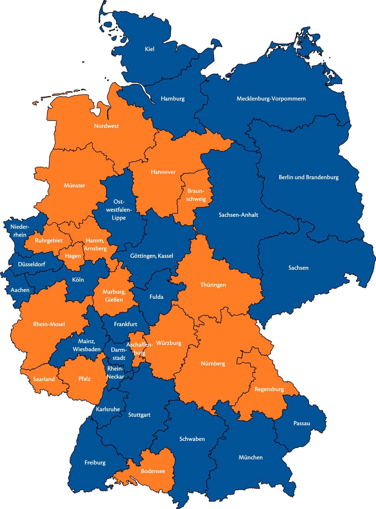

# MyKoAutomationSuite
This project serves to automate tasks which need to be done regularly as MY-Coordinator in Mensa Germany.

It generates and maintains a SQL-based database for an easy access of data for other scrips as well as extraction of insights.

Individualized documents can be produced and send to recipients with little effort and in a error-tolerant way.

Figures depicting the current state of the team or open volunteering positions, can be generated for newsletters or presentations. E.g.

The DB can be directly prompted to look up basic information or extract interesting statistical details in a straight-forward manner.